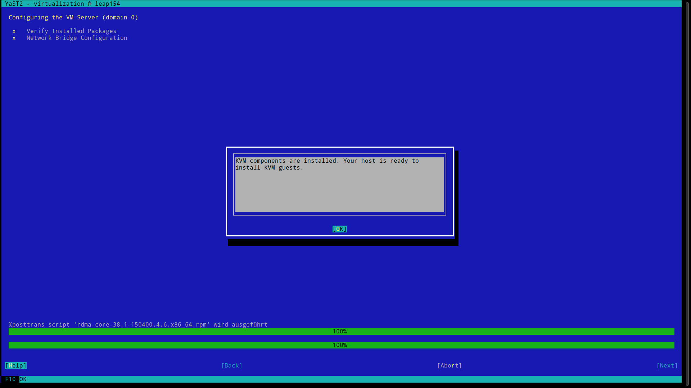

## Installation von Libvirt unter openSUSE 15.4

In Kapitel 4.3.5 wird der Terraform-Provider für libvirt vorgestellt. Um die Beispiele nachvollziehen zu können wird die Installation von libvirt unter openSUSE 15.4 beschrieben. Das System kann entweder ein Rechner oder Laptop sein, auf dem openSUSE Leap 15.4 installiert ist. Sofern der Hypervisor die sog. [_nested virtualization_](https://en.wikipedia.org/wiki/Nested_virtualization) unterstützt, kann auch eine virtuelle Maschine verwendet werden. Zugang per SSH sowie erweiterte Benutzerrechte per `sudo` werden vorausgesetzt.

Sollten Sie eine andere Linux-Distribution verwenden, so nutzen Sie bitte die Dokumentation Ihrer Distribution zur Installation von libvirt. Grundsätzliche Schritte wie die Prüfung der CPU-Virtualisierung sind auf allen Linux-Distributionen gleich, jedoch unterscheiden sich evtl. Paketnamen, Pfade und Befehle.

1) Prüfung auf Unterstützung von CPU-Virtualisierungsfunktionen

    Das KVM-Modul erlaubt die Beschleunigung der Virtualisierung, benötigt hierfür jedoch Virtualisierungsfunktionen der CPU. Diese sind z.T. im UEFI/BIOS abgeschaltet. Ob dies der Fall ist, kann durch den nachfolgenden Befehl geprüft werden. Dieser sucht in der Datei _/proc/cpuinfo_ nach den Begriffen `vmx` (Intel) oder `svm` (AMD).

    ```sh
    $ grep -Eo '(vmx|svm)' /proc/cpuinfo | sort -u
    svm
    ```

    Sind die CPU-Funktionen zur Virtualisierung aktiv, so prüfen Sie bitte, ob das Modul `kvm` bereits geladen wurde:

    ```sh
    $ lsmod | grep ^kvm
    kvm_amd               110592  0
    kvm                   786432  1 kvm_amd
    ```

    In virtuellen Maschinen ist häufig ein Linux-Kernel installiert, der nur eine geringe Anzahl an Funktionen und Modulen mitbringt. Zu den fehlenden Funktionen gehört auch das Modul `kvm`. Ist bei Ihnen nicht bereits der `default`-Kernel installiert, so installieren Sie ihn bitte und starten das System neu:

    ```sh
    $ sudo zypper in -y kernel-default
    [...]
    $ sudo reboot
    ```

2) Installation der benötigten Software für QEMU/KVM

    Für die Installation sollte das Paket `yast2-vm` installiert werden.

    Die benötigten Befehle lauten wie folgt:

    ```sh
    $ sudo zypper ref
    [...]
    $ sudo zypper in -y yast2-vm polkit
    [...]
    $ sudo yast
    ```

    Der letzte Befehl startet [YaST2](https://yast.opensuse.org/), hier kann unter `Virtualisation` der Punkt `Install Hypervisor and Tools` ausgewählt werden, um die benötigten Software zu installieren.

   

    Wählen Sie bitte im nächsten Fenster `KVM server` und `KVM tools` aus und bestätigen Sie mit `Accept`.

   

    Je nachdem ob Sie eine grafische Oberfläche verwenden oder nur per SSH auf einer VM angemeldet sind, kommt eine Abfrage, ob die grafische Werkzeuge installiert werden sollen.
    Wählen Sie hier die für Sie passende Option, in einer VM ohne grafische Oberfläche wollen Sie die grafischen Werkzeuge vermutlich nicht installieren.

   

    Es folgt eine Nachfrage zur Netzwerkkonfiguration:

   

    Sobald die Meldung `KVM components are installed. Your host is ready to install KVM guests.` erscheint, ist die Installation erfolgreich abgeschlossen.

   

3) Prüfung mit Hilfe der virsh-Tools

    Um zu überprüfen, ob die Installation vollständig ist und libvirt einsatzbereit ist, können Sie über die folgenden Befehle die laufenden virtuellen Maschinen (`domains` in libvirt-Terminologie), Pools und Netzwerke auflisten:

    ```sh
    $ export LIBVIRT_DEFAULT_URI="qemu:///system"

    $ virsh list --all
    [...]
    $ virsh pool-list --all
    [...]
    $ virsh net-list --all
    [...]
    ```

    Da Ihr Benutzer noch nicht in der Gruppe `libvirt` ist, darf dieser die Befehle nicht ausführen. Es erscheint eine Abfrage von [PolicyKit](https://de.wikipedia.org/wiki/Polkit), bei der Sie das root-Passwort eingeben müssen:

    ```sh
    $ virsh list --all
    ==== AUTHENTICATING FOR org.libvirt.unix.manage ====
    System policy prevents management of local virtualized systems
    Authenticating as: root
    Password:
    ==== AUTHENTICATION COMPLETE ====
     Id   Name   Status
     ---------------------
    $
    ```

    Um diese Nachfrage zu vermeiden, fügen Sie Ihren Benutzer (im Beispiel `tux`) der Gruppe `libvirt` hinzu:

    ```sh
    sudo usermod -a -G libvirt tux
    ```

    Wenn Sie sich abmelden und nochmal anmelden, sollten Sie in der Ausgabe des Kommandos `id` die Gruppe libvirt sehen. Zudem sollten Sie die obigen `virsh`-Befehle jetzt ohne Passwortabfrage ausführen dürfen.

Gratulation, Ihre Libvirt-Installation ist vollständig eingerichtet.

